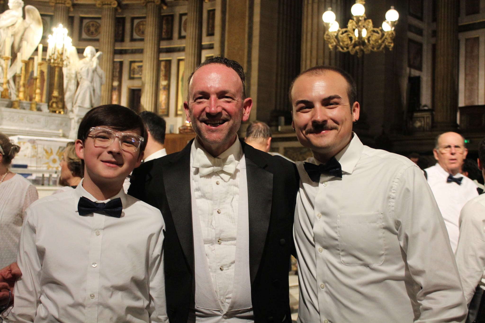

This page is where you can iterate. Follow the lab instructions in the [readme.md](./README.md).

<h1>To-Do List - March 2</h1>

Work

<ul>
  <li>7:30AM - Finish Homework :)</li>
  <li>8:15AM - Morning Hotline Meeting</li>
  <li>9AM - Client Intake (in-person)</li>
  <li>10:30AM - Court Accompaniment</li>
  <li>1:00PM - Lunch!</li>
  <li>4PM - Client Intake (telephonic)</li>
</ul>

School

<ul>
  <li>5PM - Commute to GC</li>
  <li>6:30PM - Class</li>
</ul>

# Music Makes The World Go Round

For the past 15 years, I have been an avid partaker in choral singing. Music, specifically singing, became one of the most important parts of my life at an early age. Being a part of my choir has quite literally brought me around the world from London to Dublin to Paris. <em> Below is a photo of me, my brother, and my choir director after our performance of Gabriele Faure's "Requiem" at La Madeleine in Paris, France this past summer.</em> I also love jamming out to music on the daily while exercising, cleaning my house, or simply to decompress. 

<h2>Some of the musical genres I listen to are...</h2>

<table>
<thead>
<tr>
<th>Music Genre</th>
<th>Genre Ranking</th>
</tr>
</thead>
<tbody>
<tr>
<td>Alt Pop</td>
<td>1</td>
</tr>
<tr>
<td>EDM/Dance</td>
<td>2</td>
</tr>
<tr>
<td>Folk</td>
<td>3</td>
</tr>
<tr>
<td>Classic Rock</td>
<td>4</td>
</tr>
<tr>
<td>Classical</td>
<td>5</td>
</tr>
</tbody>
</table>

