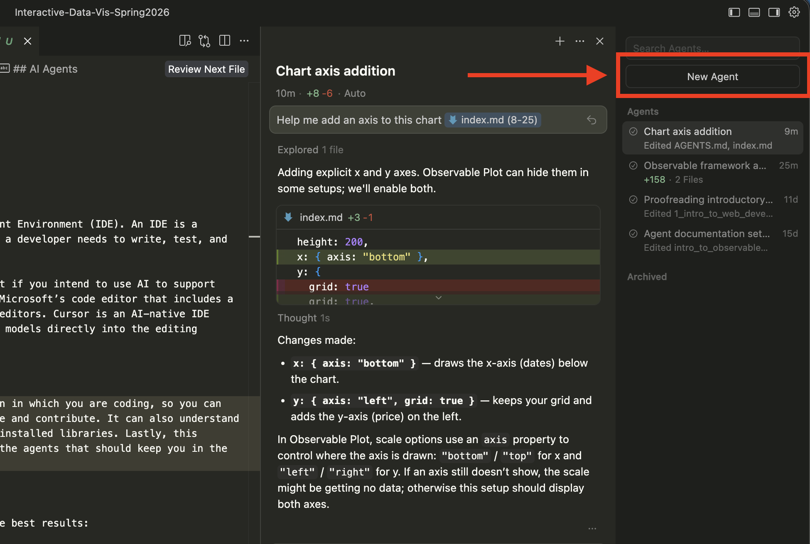
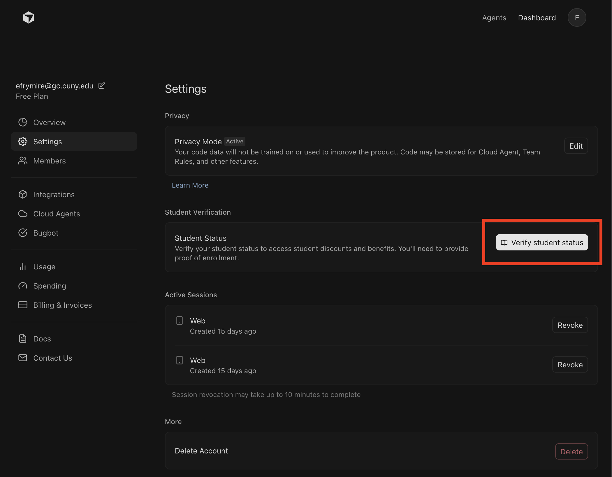

# Working in Cursor

---

In order to write code, we use an Integrated Development Environment (IDE). An IDE is a software application that combines the essential tools a developer needs to write, test, and debug code. 

You can use either Cursor or VS Code in this class, but if you intend to use AI to support your workflow, then Cursor is recommended. VS Code is Microsoft’s code editor that includes a library of plug-ins, and one of the most popular code editors. Cursor is an AI-native IDE built on top of VS Code that integrates large language models directly into the editing experience. 

## AI Agents

Cursor includes AI agents right in the same application in which you are coding, so you can reference your code, and it can directly edit your file and contribute. It also understands your file structure, the framework, and the available and installed libraries. Lastly, this repository comes with some recommended guardrails and library context for the agents that should keep you in the right technical direction. 

You can open a new agent with the right hand panel and converse with them directly.

### Tips for using an agent

To get the best results working with agents in cursor (and in general):

*   **Be specific.** Say what you want in concrete terms—e.g. “Add a bar chart of species counts to the dashboard” instead of “make a chart.” 
*   **Reference files.** Mention the file you’re working in (e.g. “In `lab_1/index.md`…”) so the AI knows where to apply changes. You can also highlight code and add to the chat directly to keep it focused.
*   **Ask for one thing at a time.** Request a single change or one chart at a time so you can see what changed and learn from it. The changes should be driven by you -- not the agent to complete tasks. 
*   **Save files before asking:** Save your file before asking the AI for help so it sees your latest code. Even better, you can commit before working with an agent so you can easily disgregard changes through changes tab if you don't like whats been done.
*   **Don’t ask for a full assignment.** The AI should support small, focused tasks—not complete the assignment for you.

## AGENTS.md
This repository already comes with helpful agent resources to guide you while working. The resources that have been included are:
1. **[`AGENTS.md`](../../AGENTS.md)**: This file is the entry point for agents to figure out where to look to answer your questions and work with you. It includes a "proof of reading" in which it should be printing "Loaded AGENTS.md" at the start of responding to your queries. This includes some rules that it should always do, and the location of some references to read when determining technical responses. 
2. **[`llms.txt`](../../llms.txt)**: The llms text file is a short project summary for AI tools, like key technologies (Framework, Plot, Inputs, D3), links to the `.ai` docs, and conventions (e.g. use Plot for charts, work in `index.md`). This is often used by crawlers and indexers that feed context to LLMs.
3. **[`.ai/`](../../.ai)**: The `.ai` filder includes docs that agents are told to read before writing code. It includes `observable-framework.md` (markdown syntax, reactivity, data loaders), `observable-plot.md` (Plot marks and options), and `d3.md` (D3 utilities and when to use D3 vs Plot). This folder keeps answers aligned with this stack, so agents don't send you in different technical directions than the focus of the class.
4. **[`.cursor/`](../../.cursor)** : This folder includes cursor-specific config. In particular, the **`rules/`** holds guardrails that apply when you work here (e.g. tech stack, use Plot for charts, lab scope). Rules are applied automatically so the AI stays within course expectations.

These files are fairly specific to this class and this repository, so using agents in cursor in this repo should be more effective, but also means that the agent replies are not as transferrable outside of coursework. 

## Cursor Pro 

As is typical with new technologies, the financial model pushes for subscription, but you can get a free year of Cursor Pro as a student. It takes some work, but: 
1. Make an account with an edu email 
2. Verify your student status in your settings
3. Upload your class list or CUNY ID with the third party to confirm.

